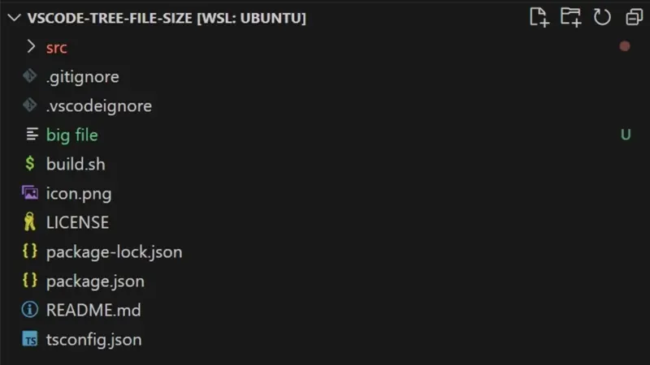

# Tree File Size

**Tree File Size** is a VS Code extension that shows you the size of files and folders right in the Explorer—just hover for a tooltip! It's a handy way to spot big files, keep your repo tidy, and avoid bloat. Plus, it respects your `.gitignore` if you want.

---

## 🚀 What It Does

- **File & Folder Size Tooltips:** Hover over any file or folder in the Explorer to see its size (yep, folders show the total size of everything inside).
- **.gitignore Support:** Skip files and folders you don't care about (toggle in settings).
- **Pick Your Units:** Show sizes in bytes, KB, MB, GB, TB, or let it pick automatically.
- **Fast & Async:** Won't slow down your VS Code, even on big projects.
- **Auto-Refresh:** Updates when files change or you tweak settings.

---

## 🛠️ How to Use

1. **Install:**
   - Find `Tree File Size` in the VS Code Marketplace, or use a `.vsix` file.
2. **Open a Folder:**
   - Open any project folder in VS Code.
3. **Hover in the Explorer:**
   - Move your mouse over any file or folder in the sidebar. The tooltip will show the size (e.g., `Size: 1,234.56 KB`).
4. **Settings:**
   - Open VS Code settings (`Ctrl+,` or `Cmd+,` on Mac) and search for `Tree File Size`.
   - Change the unit or toggle `.gitignore` support as you like.

---

## ⚙️ Settings

| Setting                         | What it does                                              | Default |
| ------------------------------- | --------------------------------------------------------- | ------- |
| `treeFileSize.unit`             | Unit for file sizes (`auto`, `b`, `kb`, `mb`, `gb`, `tb`) | `auto`  |
| `treeFileSize.respectGitignore` | Ignore files/folders in `.gitignore` when sizing          | `true`  |

---

## 📂 Folder Sizes

- Hover over a folder to see the total size of everything inside (recursively, and respects `.gitignore` if enabled).

---

## ℹ️ Why Not Inline?

**"Why can't I see the size right next to the file name in the Explorer?"**

We'd love that too! But VS Code's extension API doesn't allow us to add custom text inline with file/folder names in the built-in Explorer. The only way to show extra info is with a tooltip (when you hover) or a tiny badge on the icon (which is too small for real sizes). If VS Code ever allows inline text, we'll add it!

---

## ❓ FAQ

**Q: How do I force a refresh?**

> The extension updates automatically on file changes and config changes. You can also reload the window (`Ctrl+Shift+P` → `Reload Window`).

**Q: Does it work with multi-root workspaces?**

> Right now, only the first workspace folder's `.gitignore` is used. Multi-root support is on the roadmap.

**Q: Is it safe for big projects?**

> Yes! It scans in the background and skips ignored files for speed.

---

## 📝 Release Notes

### 0.0.3

- Add `.gitignore` support (configurable)
- Folder tooltips now show total size
- Improved docs and settings

### 0.0.2

- Tooltip-only display for file/folder sizes

### 0.0.1

- First release: file/folder size tooltips, configurable units

---

## 💡 Feedback & Contributions

Found a bug? Have an idea? PRs and issues welcome! [GitHub repo](https://github.com/your-repo/tree-file-size)
